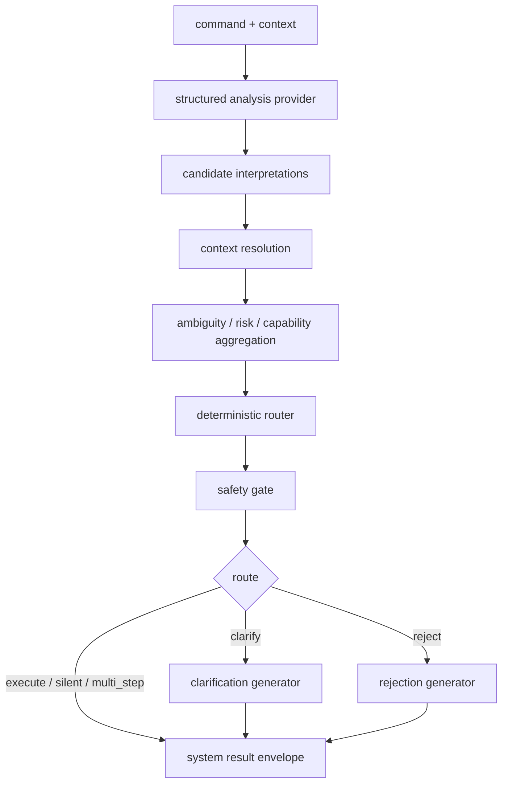
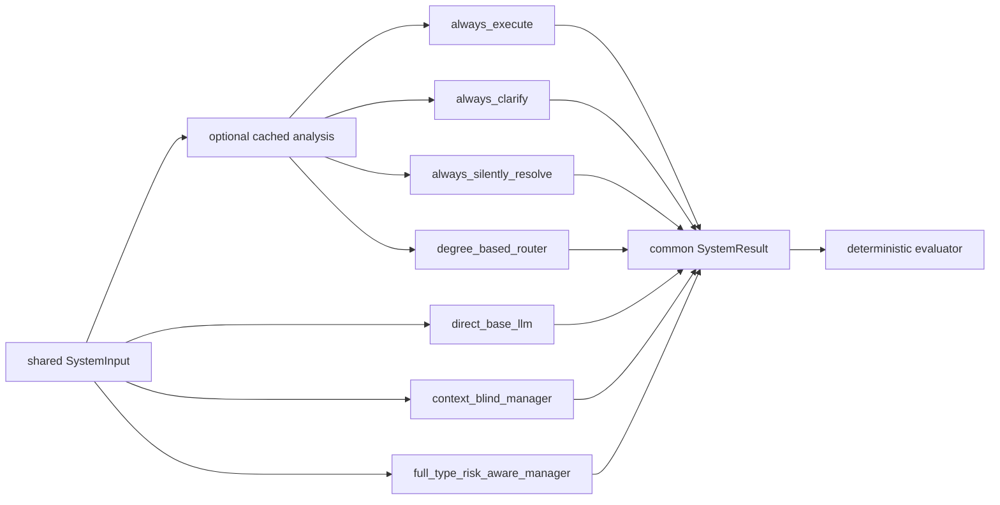

# Ambiguity-manager architecture (T16–T24 foundation)

Model-independent foundation only. Official execution remains blocked pending adjudicated gold (T14/T15), viable model strategy where required, and T29 protocol freeze.

## Manager flow

## Seven-system comparison flow

## Package layout

- `src/ambiguity_manager/systems/` — contracts, providers, candidates, uncertainty, resolver, classification, router, safety, responses, seven adapters, runner
- `src/ambiguity_manager/evaluation/` — deterministic metrics and eligibility
- `configs/manager/` / `configs/evaluation/` / `configs/experiments/` — versioned unfrozen development configs
- `scripts/run_manager_experiment.py` — synthetic/gated CLI

## Official vs foundation

| Mode | Allowed now |
|---|---|
| `synthetic_smoke` | yes |
| `development` | yes (no protected labels) |
| `official` | blocked until gold + T15 + protocol freeze + model strategy where needed |
