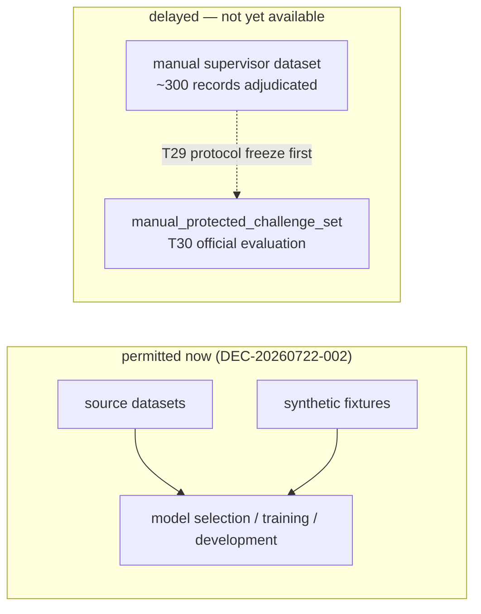
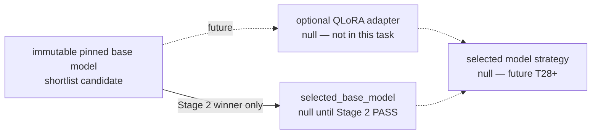

# Report — development base-model shortlist and bake-off protocol

**Author:** Mohammed Bangie — 2610990  
**Decision:** `DEC-20260722-002`  
**Branch:** `feature/t12-cluster-redesign`  
**Scope:** frozen development shortlist, selection policy, development set, cluster operator profiles  
**Status:** infrastructure and protocol complete; **cluster bake-off execution pending**  
**Not in scope:** QLoRA training, adapter selection, T13 calibration, manual annotation, official claims

## Development-only shortlist

The three-candidate shortlist in `configs/model/base_model_candidates_v1.json` is a **development-only** bake-off registry. It is **not** valid for official final claims:

| Field | Value |
|---|---|
| `status` | `development_shortlist` |
| `development_only` | `true` |
| `valid_for_official_use` | `false` |
| `selected_base_model` | `null` |
| `selected_adapter` | `null` |
| `selected_model_strategy` | `null` |

`selected_base_model` remains **`null`**. Development Stage 1 transport completed for all three candidates; **no candidate passed the frozen 4/4 hard gate**. Contract status is now `no_viable_base_candidate`. Stage 2 was not run. No QLoRA begun.

## Development set

| Field | Value |
|---|---|
| Manifest ID | `model_selection_development_set_v1` |
| Record count | **40** |
| Directory | `data/development/model_selection_v1/` |
| `manifest_hash` | `70651a6ed5e396235afceb97b8b918e06f0ff742d9a64c15f6444833aaa49cb3` |
| `valid_for_official_final_claims` | `false` |

Sources: 16 T16–T24 synthetic fixtures, 10 schema-v2 route-pressure rows, 14 hand-authored `msel_dev_*` records. T13 calibration IDs and future manual namespaces are excluded. See `docs/dataset_cards/model_selection_development_set.md`.

Transport smoke subset: four frozen IDs in `data/development/model_selection_v1/transport_smoke_ids.json`.

## Candidates (pinned revisions)

Registry path: `configs/model/base_model_candidates_v1.json`  
Registry `canonical_hash`: `d7bd41c1f841afd197a9521bdca0a3fc89ee4b9c0803e41bbd0cf7953dcc4934`

| `candidate_id` | Repository | Revision |
|---|---|---|
| `qwen3_8b` | `Qwen/Qwen3-8B` | `b968826d9c46dd6066d109eabc6255188de91218` |
| `phi4_14b` | `microsoft/Phi-4` | `2db69c1c3e91a05d2c64a3185acfbaf36f744e25` |
| `mistral_small_24b_2501` | `mistralai/Mistral-Small-24B-Instruct-2501` | `9527884be6e5616bdd54de542f9ae13384489724` |

Screened-out families (gated Llama/Gemma, redundant size bands, historical tiny locals) are documented in the same registry file.

## Selection policy

Frozen in `configs/model/base_model_selection_policy_v1.json`:

| Field | Value |
|---|---|
| `policy_version` | `1.0.0` |
| `status` | `frozen_for_development_bakeoff` |
| `frozen_before_stage_2` | `true` |
| `ranking_mode` | `lexicographic_weighted` |
| `valid_for_official_use` | `false` |

Priority criteria (in order): safety/unsupported commitments → structured-output reliability → joint intent/CPC → compound ambiguity → context use / blind separation → QLoRA feasibility → cost/latency.

Hard rejections include Stage 1 transport failure, schema collapse, unsafe commitments, runtime incompatibility, snapshot/licence failure, insufficient context length, and no plausible QLoRA path. Loader/applier: `src/ambiguity_manager/model/base_model_selection.py`.

## Cluster operator profiles

Configured in `configs/cluster/t12_job_profiles.json`; operator CLI: `scripts/t12_cluster_job.py`. Runbook: `docs/runbooks/model_candidate_bakeoff_operator.md`.

| Profile | Stage | Purpose |
|---|---|---|
| `model_candidate_preflight` | Stage 0 | Metadata, revision, licence, tokenizer, runtime compatibility (no full generation) |
| `model_candidate_transport_smoke` | **Stage 1** | Four-record strict structured-output transport gate |
| `model_candidate_bakeoff` | **Stage 2** | Full 40-record development bake-off; emits `full_context` + `context_blind` cache entries |

Pinned runtime: `vllm-openai-v0.20.1.sif` (sha256 `d404bdf414e1b8f2d5af1568d0565d4e2da8435f26325b281fb28b9597c548d1`).

### Stage 1 / Stage 2 protocol

**Stage 1 — transport smoke (hard gate)**

- Exactly four records from `transport_smoke_ids.json`
- Requires 4/4 attempted, zero invalid final schema, zero unrecorded attempts
- No unconstrained fallback; raw attempts retained
- Failure → hard rejection (`stage1_transport_failure`); candidate cannot proceed to Stage 2

**Stage 2 — full development bake-off (ranking input)**

- All 40 frozen development records
- Generates variant-aware analysis cache entries for both `full_context` and `context_blind`
- Eligibility-aware development metrics only (`metrics_summary.json`)
- Lexicographic ranking per frozen policy; winner updates `selected_base_model` only after PASS evidence is pulled and verified

**Current execution status (2026-07-22):** Stage 0/1 executed on Wits `biggpu`. Evidence under `configs/model/evidence/model_selection_bakeoff_v1/`.

| Candidate | Stage 1 accepted/required | Primary failure | Run ID |
|---|---|---|---|
| `qwen3_8b` | 3/4 | `unsupported_silent_commitment` on `msel_t12_syn_005` | `t12-mc-transport-20260722T191742Z-96f6191` |
| `phi4_14b` | 1/4 | semantic schema / canonical assembly failures | `t12-mc-transport-20260722T201932Z-b07f7e7` |
| `mistral_small_24b_2501` | 0/4 | empty remote result directory after COMPLETED job 4364 | `t12-mc-transport-20260722T203945Z-da7e69e` |

**Selection decision:** `no_viable_base_candidate` under the zero-shot policy. `zero_shot_candidate_status = rejected` (immutable). `adaptation_base_status = null` until Phase D applies `adaptation_base_selection_policy_v1.json`. `selected_base_model` / `selected_adapter` / `selected_model_strategy` remain `null`. Stage 2 not started.

## Zero-shot rejected ≠ adaptation-base ineligible

The frozen zero-shot bake-off (`base_model_selection_policy_v1.json`) and the adaptation-base selection policy (`adaptation_base_selection_policy_v1.json`) are **separate contracts**:

| Layer | Policy file | Stage-1 4/4 required? | Current status |
|---|---|---|---|
| Zero-shot candidate | `base_model_selection_policy_v1.json` | **Yes** | `zero_shot_candidate_status = rejected` |
| Adaptation base (QLoRA) | `adaptation_base_selection_policy_v1.json` | **No** | `adaptation_base_status = null` (Phase D pending) |

A model that failed the zero-shot hard gate may still be technically eligible as an immutable QLoRA development base if it meets adaptation-base hard requirements (verified snapshot, tokenizer/runtime load, ≥1 strict structured output, plausible 4-bit path, etc.). Zero-shot rejection evidence in `bakeoff_outcome` must not be erased or superseded. Adaptation-base selection does not approve an adapter, model strategy, or official use. See `docs/decisions/DEC-20260722-003_zero_shot_vs_adaptation_base_eligibility.md`.

## Data timing

Development scoring and model selection proceed on source/synthetic partitions. The future manual gold must not influence selection, training, or threshold tuning.

## Model identities

Three-part identity contract (`configs/model/selected_identities_v1.json`) remains all-null until official selection stages after protocol freeze.

## Key implementation paths

| Area | Path |
|---|---|
| Candidate registry | `configs/model/base_model_candidates_v1.json`, `src/ambiguity_manager/model/base_model_candidates.py` |
| Selection policy | `configs/model/base_model_selection_policy_v1.json`, `src/ambiguity_manager/model/base_model_selection.py` |
| Prompt contract | `configs/model/bakeoff_prompt_contract_v1.json` |
| Development set builder | `scripts/build_model_selection_development_set.py`, `src/ambiguity_manager/data/model_selection_set.py` |
| Cluster scripts | `scripts/t12_model_candidate_preflight.py`, `scripts/t12_model_candidate_transport_smoke.py`, `scripts/t12_model_candidate_bakeoff.py` |
| Runtime config | `configs/cluster/model_candidate_bakeoff_runtime.json` |
| Tests | `tests/test_base_model_candidates_and_selection.py`, `tests/test_model_status_layers.py`, `tests/test_model_selection_development_set.py`, `tests/test_model_candidate_bakeoff_operator.py` |

## Confirmation

| Item | Status |
|---|---|
| T13 calibration used | **No** — excluded from development set and bake-off |
| Manual annotations created | **No** |
| QLoRA in this task | **No** |
| `selected_adapter` | `null` |
| `selected_model_strategy` | `null` |
| `valid_for_official_use` | `false` |
| Official experiment executed | **No** |
| Cluster bake-off evidence on disk | **None yet — pending cluster execution** |
