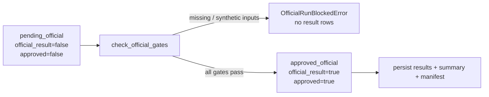

# Ticket report — T16–T24 context ablation and run-status fix

**Author:** Mohammed Bangie — 2610990  
**Decision:** `DEC-20260722-001`  
**Branch:** `feature/t12-cluster-redesign`  
**Scope:** two narrow corrections only — strict context-blind analysis identity, and runner-owned official result status  
**Precedes:** model selection, human annotation, official experiment execution  
**Does not rewrite:** T16–T24 architecture, evaluator metric mathematics, router/resolver/safety/annotation logic beyond the defects named below

## Why semantic sanitisation is invalid for context ablation

A full-context `StructuredAnalysis` may already have been shaped by dialogue, scene, and capability context in ways that no field-strip heuristic can reverse:

- CPC slot fills (e.g. object = “red cup” from a pointing gesture)
- candidate interpretations and selected interpretation
- supporting / resolution evidence sourced from scene or dialogue
- ambiguity type, risk, and capability decisions
- resolved vs unresolved slot sets

Stripping a few obvious context-linked resolved slots while continuing to execute the remainder is not a valid ablation. Context-derived meaning can survive in CPC, candidates, labels, and evidence that the sanitiser never touched.

## Required fresh / matching ablated analysis

A context-blind system may use only:

| Option | Requirement |
|---|---|
| A | Fresh analysis from the ablated `SystemInput` (command retained; dialogue/scene/capability removed; original input immutable) |
| B | Cached analysis whose provenance explicitly identifies the `context_blind` variant **and** whose recorded ablated/source input hash exactly matches the ablated input |

It must never sanitise and reuse a full-context semantic analysis.

## Variant-specific cache identity

`AnalysisIdentity` distinguishes at least `full_context` vs `context_blind` and includes:

- record ID
- canonical source `SystemInput` hash (ablated hash for context-blind)
- analysis variant
- provider ID / version
- model-strategy identity where applicable
- analysis content hash

Full-context and context-blind analyses for the same record therefore have different identities. The input/run manifest records variant, source-input hash, content hash, and provider provenance for each supplied cache.

## Behaviour when no ablated analysis / provider exists

When the supplied cache is rejected and no analysis provider is configured, the context-blind manager returns an honest `execution_status=provider_unavailable` result with:

- empty analysis (no surviving CPC / candidates / evidence)
- `rejected_full_context_cache=true`
- `stripped_context_derived_fields=false`
- `reason=matching_ablated_analysis_unavailable`

## Runner-owned status semantics

| Mode | `synthetic_only` | `official_result` |
|---|---|---|
| `synthetic_smoke` | `true` | `false` |
| `development` (non-synthetic inputs) | `false` | `false` |
| `development` (explicitly synthetic fixtures) | `true` | `false` |
| `official` (approved after all gates) | `false` | `true` |

No adapter, system implementation, or evaluator may independently override these flags. `RunContext` is the authority.

## Official gate transition

Failed or incomplete official gates prevent execution entirely. They do not create development-looking rows with `official_result=false`.

## Evaluator status propagation

`EvaluationBundle` inherits `run_mode`, `synthetic_only`, `official_result`, and `run_id` from the verified `RunContext` (or from a homogeneous prediction set). Mixed run-status flags across predictions raise `EvaluationContractError`. Official status is never inferred merely because a gold file exists. Multi-system evaluation requires identical validated status across all seven system bundles.

## Verifier checks added

`verify_run` now checks:

- manifest / summary / result / evaluation-bundle mode consistency
- `synthetic_only` / `official_result` consistency against stored `run_context`
- context-blind analysis variant and ablated-hash consistency
- rejection of context-blind results that reference a full-context analysis identity

## Tests and evidence

| Suite | Focus |
|---|---|
| `tests/test_t16_t24_context_ablation_hardening.py` | adversarial full-context rejection; matching/fresh acceptance; identity distinction; immutability; honest not-executable |
| `tests/test_t16_t24_run_status_hardening.py` | RunContext semantics; official approval doubles; evaluator inheritance; mixed-status rejection; verify_run corruption; cache-manifest identity |
| `tests/test_t23_runner_integrity_hardening.py` | updated RunContext / development synthetic fixture expectations |

## Confirmation — no official experiment

- No model was selected (`selected_base_model` / `selected_adapter` / `selected_model_strategy` remain `null`)
- No model inference or training occurred
- No human annotation or gold creation occurred
- No SSH / Slurm / GPU / vLLM / external API execution occurred
- Official approval was exercised only with deterministic temporary test doubles
- T13 calibration package hashes were not modified
