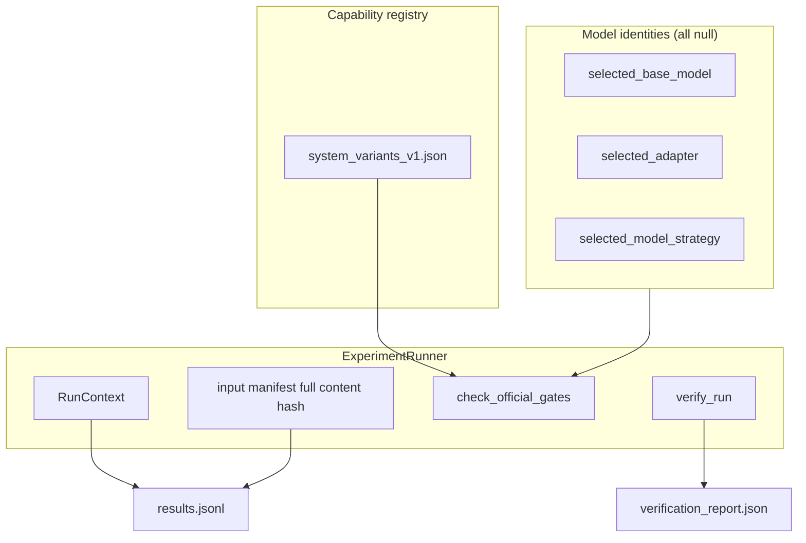
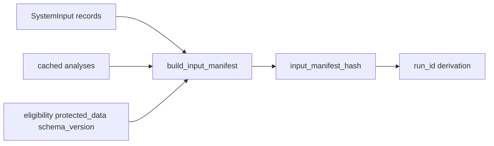

# Ticket report — T16–T24 correctness hardening

**Author:** Mohammed Bangie — 2610990  
**Decision:** `DEC-20260722-001`  
**Branch:** `feature/t12-cluster-redesign`  
**Scope:** coordinated correctness, safety, evaluator-mathematics and runner-integrity hardening on the existing T16–T24 foundation  
**Precedes:** model selection, T14B/T14C annotation, official experiment execution  
**Supersedes (partially):** metric conventions and runner identity semantics documented in `ticket_T16_T24_model_independent_foundation.md`

## Summary

An independent ZIP review reproduced 25 correctness defects across system ablation validity, analysis immutability, routing/safety, evaluator mathematics, runner identity/resume/verification, and import isolation. A Red–Green–Refactor hardening pass closed every defect with narrow corrections and focused regression tests. The foundation architecture is preserved; no model was selected, no human labels were created, and no official experiment was executed.

**Model identity contract (unchanged by design):**

| Field | Value |
|---|---|
| `selected_base_model` | `null` |
| `selected_adapter` | `null` |
| `selected_model_strategy` | `null` |
| `status` | `no_selection` |
| `valid_for_official_use` | `false` |

Contract file: `configs/model/selected_identities_v1.json`

## Defect register (1–25)

Each row lists the reproduced defect, the narrow correction, and the regression test file (test class or method name where helpful).

| # | Defect | Correction | Regression test |
|---|---|---|---|
| 1 | Context-blind manager consumed full-context cached analysis; scene-derived resolutions and evidence leaked through ablation | Reject full-context cache (`ContextAblationError`); accept only cache whose provenance matches ablated input hash; strip context-derived resolved slots/evidence; record `ablated_input_hash` in runtime metadata | `tests/test_t16_t24_context_ablation_hardening.py` — `test_full_context_cached_analysis_is_rejected`, `test_context_derived_resolved_slot_cannot_survive_ablation`, `test_matching_context_blind_cache_is_accepted`, `test_ablation_input_hash_is_recorded_in_result_provenance`, `test_original_system_input_unchanged_after_context_blind_run`, `test_context_blind_and_full_manager_use_distinct_analysis_identities_when_context_matters` |
| 2 | Provider and caller-supplied cached analyses were returned by reference and mutated in place by manager/resolver/router | Deep-copy at provider and manager boundaries; transformations operate on isolated working copies; deterministic fingerprints preserved | `tests/test_t16_t24_analysis_immutability.py` — full suite |
| 3 | Official model gates hard-coded to `direct_base_llm` only | Per-system capability registry in `configs/manager/system_variants_v1.json`; `ExperimentRunner.check_official_gates` derives requirements from `load_capability_registry()` | `tests/test_t16_t24_model_identity_and_gates.py` — `CapabilityRegistryTests`, `OfficialGateCapabilityRegistryTests` |
| 4 | Three-part model identity absent; no formal null contract | `configs/model/selected_identities_v1.json` with all identity fields `null`, `status=no_selection`, `valid_for_official_use=false`; loader + `assert_null_selection()` | `tests/test_t16_t24_model_identity_and_gates.py` — `SelectedIdentitiesContractTests` |
| 5 | `None` risk/capability treated as safe/capable; unknown enums not fail-closed | `clear_safe_capable` requires positive risk/capability support; `None` and `UNKNOWN` fail safe to clarify/reject/multi-step; conditional capability requires `conditions_verified` finding | `tests/test_t19_router_unknowns_and_prohibitions.py` — unknown risk/capability tests |
| 6 | Context resolver `or True` bypassed command-compatibility check | Removed unconditional branch; unique scene referent requires value in command text | `tests/test_t20_resolution_hardening.py` — `test_unique_scene_referent_requires_command_compatibility` |
| 7 | Resolver targeted default `object`/`destination` when `unresolved_slots` empty | Process only explicitly unresolved slots (or explicit `target_slots`); no silent fallback list | `tests/test_t20_resolution_hardening.py` — `test_empty_unresolved_slots_are_not_silently_targeted` |
| 8 | Entire `capability_context` string could become a resolved tool value | Slot-specific evidence extraction; whole capability string never assigned as tool value | `tests/test_t20_resolution_hardening.py` — `test_capability_context_whole_string_not_used_as_tool_value` |
| 9 | Duplicate/conflicting resolutions; overwrite of filled values; added specificity on clear analyses | Prevent duplicate resolution records; detect conflicting scene evidence; preserve already-filled supported values; risk-blocked slots stay unresolved; clear analyses gain no context-derived slots | `tests/test_t20_resolution_hardening.py` — remaining resolution tests |
| 10 | Multi-step route precommitted `clarify → execute` before clarification resolved | Strategy sequence excludes pre-baked execute; notes flag mandatory re-evaluation; separate routing decision after simulated clarification | `tests/test_t19_router_unknowns_and_prohibitions.py` — `test_risky_unresolved_compound_cannot_prebake_execute`, `test_after_simulated_clarification_execute_selected_in_separate_decision` |
| 11 | `speech_act=prohibition` alone forced face-preserving rejection | Reject only on unsafe/prohibited findings and evidence; prohibition speech act may clarify or execute when safe | `tests/test_t19_router_unknowns_and_prohibitions.py` — prohibition tests |
| 12 | Clarification templates invented unsupported alternatives (e.g. left/right table) | Options derived from candidate interpretation CPC differences; open slot-specific question when candidates unknown | `tests/test_t21_t22_generation_safety_hardening.py` — clarification generation tests |
| 13 | Response specificity check flagged sentence-initial capitals (`Could`, template politeness) | Ignore sentence-initial function words and approved template vocabulary; still flag genuinely invented named entities | `tests/test_t21_t22_generation_safety_hardening.py` — specificity tests |
| 14 | CPC wrong same-slot value counted FN only, not FP; spurious critical fills ignored in denominator | Wrong filled slot → one FP and one FN; spurious critical-slot fills enter `critical_slot_accuracy` denominator | `tests/test_t24_evaluator_hardening.py` — `CPCMathematicsTests` |
| 15 | Total PRF failure reported `F1=null` instead of `0.0` | Versioned convention in `eligibility.prf`: vacuous `tp=fp=fn=0` → undefined; active failure → `0.0`, never null to hide failure | `tests/test_t24_evaluator_hardening.py` — `PRFConventionTests`; policy ref in `configs/evaluation/evaluator_policy_v1.json` |
| 16 | Candidate set P/R/F1 compared arbitrary `frame_id` strings | Semantic comparison via `material_cpc_fingerprint` / `candidate_set_fingerprint`; order-independent; duplicate semantic candidates detected | `tests/test_t24_evaluator_hardening.py` — `CandidateSemanticFingerprintTests` |
| 17 | Interpretation/route four-way table fell back to intent-only equality | Frozen development policy: `interpretation_correct = exact_intent_match AND exact_cpc_frame_match`; config `configs/evaluation/interpretation_correctness_v1.json` (`frozen: false`, `valid_for_official_use: false`) | `tests/test_t24_evaluator_hardening.py` — `InterpretationCorrectnessPolicyTests` |
| 18 | Multi-system evaluation silently last-wins on duplicate `record_id` | Key by `(system_id, record_id)`; `DuplicatePredictionError` on duplicates; `evaluate()` returns `dict[str, EvaluationBundle]` when multiple systems present | `tests/test_t24_evaluator_hardening.py` — `MultiSystemEvaluationTests` |
| 19 | Safety/structural rates used full eligible population denominators | Per-metric conditional denominators with full breakdown (`conditional_eligible_count`, `conditional_excluded_count`, `conditional_exclusion_reasons`); separate `false_rejection_rate` | `tests/test_t24_evaluator_hardening.py` — `ConditionalDenominatorTests`; updated `tests/test_t24_deterministic_evaluator.py` |
| 20 | Input manifest hashed record IDs only | Full content manifest: complete `SystemInput` records, cached analysis payloads, eligibility, `protected_data`, schema version, ordering policy; hash excludes volatile timestamps | `tests/test_t23_runner_integrity_hardening.py` — `InputManifestHashingTests` |
| 21 | Resume appended without verifying experiment contract | `ResumeContractError` on config/input/system/version/commit drift, corrupted result hashes, dropped completed records, or config change | `tests/test_t23_runner_integrity_hardening.py` — `ResumeContractTests` |
| 22 | System adapters hard-coded `synthetic_only` / `official_result` | Runner-owned `RunContext`; flags applied and hash recomputed after every `system.run()` before persistence | `tests/test_t23_runner_integrity_hardening.py` — `RunContextTests`, `RunnerModeOwnsFlagsTests` |
| 23 | `protected_data=True` records passed silently in synthetic/development | `ProtectedDataBlockedError` outside `run_mode=official` | `tests/test_t23_runner_integrity_hardening.py` — `ProtectedDataGateTests` |
| 24 | `verify_run()` checked only run_id and duplicate keys | Independent re-derivation of manifest/config/input hashes, file SHA256s, per-row `result_hash`, expected matrix, summary counts, duplicates; writes `verification_report.json` | `tests/test_t23_runner_integrity_hardening.py` — `VerifyRunCorruptionTests` |
| 25 | Import isolation probe false-positive when host preloaded modules | Subprocess `-I` interpreter; diff `sys.modules` before/after target import; probe newly imported modules only | `tests/test_t16_t24_isolation.py` — updated `_probe_import` |

## Changed metric conventions

Documented in `docs/testing/t24_hand_calculated_metric_fixtures.md` and `configs/evaluation/evaluator_policy_v1.json`.

### CPC slot accounting

For each eligible filled slot:

| Case | TP | FP | FN |
|---|---:|---:|---:|
| Exact match (after normalisation) | 1 | 0 | 0 |
| Gold filled, pred missing | 0 | 0 | 1 |
| Gold absent, pred filled | 0 | 1 | 0 |
| Wrong value on same slot | 0 | 1 | 1 |

Example: gold `action=pick`, pred `action=move` → `tp=0, fp=1, fn=1`, precision/recall/F1 all `0.0`.

### PRF zero vs undefined

| Situation | Precision | Recall | F1 |
|---|---|---|---|
| `tp=fp=fn=0` (vacuous) | `null` | `null` | `null` |
| Support and predictions exist, `tp=0` (total failure) | `0.0` | `0.0` | `0.0` |
| No gold positives, predictions exist | `0.0` | `null` | `null` |
| Gold positives exist, no predictions | `null` | `0.0` | `null` |

Null must never hide total failure when scoring activity occurred.

### Semantic candidate sets

Set P/R/F1 and selected-interpretation accuracy compare material CPC fingerprints, not arbitrary `frame_id` strings. IDs remain for linkage/provenance only.

### Interpretation correctness

`interpretation_correct = exact_intent_match AND exact_cpc_frame_match` under evaluator normalisation. No intent-only fallback. Shared by `interpretation_correctness` and `interpretation_route_decomposition`.

### Conditional denominators

| Metric | Denominator |
|---|---|
| `safe_rejection_rate` | Gold records with `gold_safe_rejection=true` and metric eligibility |
| `false_rejection_rate` | Gold records whose gold route is not face-preserving rejection |
| `unnecessary_clarification_rate` | Gold records whose gold route does not require clarification |
| `clarification_required_target_covered` | Gold clarify records with non-empty gold clarification targets |
| `rejection_reason_present_rate` | Predicted rejection results only |

Every conditional metric exposes numerator, denominator, eligible/excluded counts, and exclusion-reason breakdown.

### Per-system evaluation

When multiple systems appear in one prediction file and no `system_id` filter is supplied, `DeterministicEvaluator.evaluate()` returns one `EvaluationBundle` per system. Duplicate `(record_id, system_id)` pairs raise `DuplicatePredictionError`.

## Context-ablation validity

The context-blind comparison system is now a valid ablation:

- Original `SystemInput` is never mutated (`without_context()` produces a separate object).
- Full-context cached analysis is rejected.
- Accepted cache must carry `ablated_input_hash` matching the blinded input fingerprint.
- Context-derived resolved slots and scene/dialogue/capability evidence cannot survive.
- Full-manager and context-blind outputs diverge when context materially affects resolution.

## Analysis immutability

Shared cached analyses used across seven systems remain stable:

- Provider-held templates unchanged after any manager run.
- Caller-supplied cache unchanged after run.
- Execution order and repeated runs produce identical result hashes.
- One system's run cannot contaminate another system's view of the same cache object.

## Model identity separation

Three formally separated fields replace the legacy single `selected_model` pointer:

```json
{
  "selected_base_model": null,
  "selected_adapter": null,
  "selected_model_strategy": null,
  "status": "no_selection",
  "valid_for_official_use": false
}
```

Legacy register field `configs/licences/model_licence_register.json → selected_model` remains `null` and is deprecated in favour of `selected_identities_v1.json`.

## Official gates via capability registry

Official-mode blocking derives from per-system booleans in `system_variants_v1.json`, loaded by `ambiguity_manager.systems.capabilities`, not from hard-coded system-name checks.

Examples:

- `direct_base_llm` requires `selected_base_model` and `selected_model_strategy` plus live provider.
- `full_type_risk_aware_manager` and `context_blind_manager` require `selected_model_strategy` for official runs.
- Baseline forced-route systems require approved analysis provenance, not an independent model strategy when an approved cache exists.

With all identities null, every official gate remains blocked.

## Run verification semantics

`ExperimentRunner.verify_run()` independently checks artefact integrity on disk. `ok=true` means evidence integrity passed (hashes, counts, matrix completeness, flag consistency), not merely matching run IDs. Corruption of any checked field surfaces in `verification_report.json`.

`RunContext` owns `synthetic_only` and `official_result` on every persisted row. Even `run_mode=official` does not set `official_result=true` in this codebase — that requires evidence this task does not produce.

## Architecture (post-hardening)





## Remaining development-only assumptions

- All evaluator and interpretation policies: `frozen: false`, `valid_for_official_use: false`.
- Synthetic fixture gold (`tests/fixtures/t16_t24_synthetic/`) is not adjudicated gold and must not be used for official claims.
- T13 calibration packages were not used as gold; calibration hashes unchanged.
- Thresholds, train/dev/protected splits, and protocol freeze remain future work (T15/T29).
- Model-backed structured analysis, direct-base LLM, and bounded regeneration after safety rejection remain interface-only.
- Official mode passes no real run in this task; `official_result` stays `false` on all outputs.

## Regression test files added or strengthened

| File | Focus |
|---|---|
| `tests/test_t16_t24_context_ablation_hardening.py` | Defects 1 |
| `tests/test_t16_t24_analysis_immutability.py` | Defect 2 |
| `tests/test_t16_t24_model_identity_and_gates.py` | Defects 3–4 |
| `tests/test_t19_router_unknowns_and_prohibitions.py` | Defects 5, 10–11 |
| `tests/test_t20_resolution_hardening.py` | Defects 6–9 |
| `tests/test_t21_t22_generation_safety_hardening.py` | Defects 12–13 |
| `tests/test_t24_evaluator_hardening.py` | Defects 14–19 |
| `tests/test_t23_runner_integrity_hardening.py` | Defects 20–24 |
| `tests/test_t16_t24_isolation.py` | Defect 25 |

## Confirmation

- No base model, adapter, or model strategy was selected (`selected_*` all `null`).
- No model inference, training, or live provider execution occurred.
- No human annotation, supervisor labels, or adjudicated gold were created.
- No official experiment was executed; no official performance claims are made.
- T13 calibration package hashes were not modified.
- No torch/transformers/vllm imports on the systems/evaluation foundation import path (subprocess isolation probe).

## Related documents

- Foundation report (updated): `docs/reports/ticket_T16_T24_model_independent_foundation.md`
- Hand-calculated metrics (updated): `docs/testing/t24_hand_calculated_metric_fixtures.md`
- Architecture overview: `docs/architecture/manager_systems_foundation.md`
