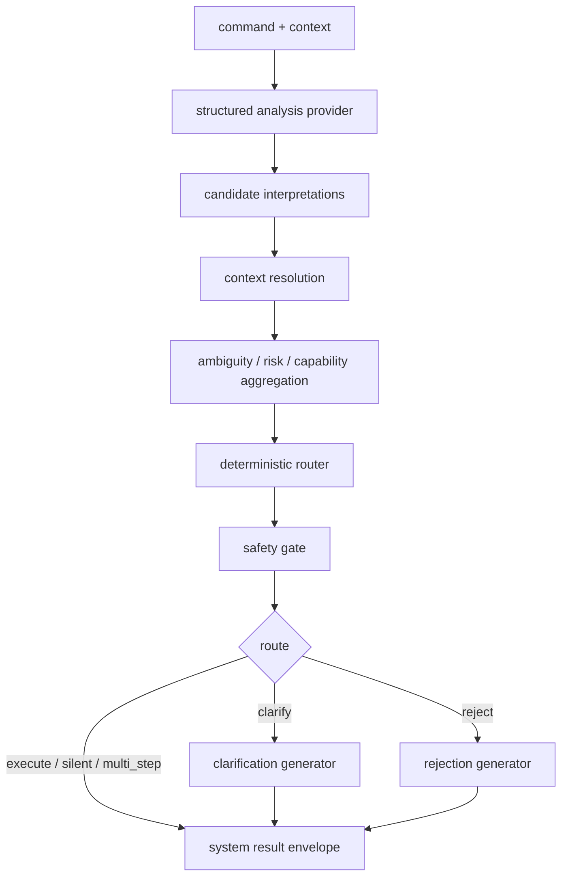
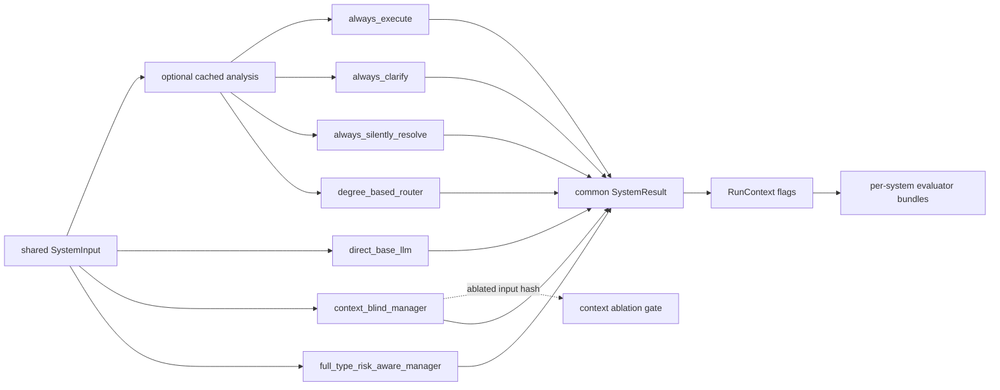
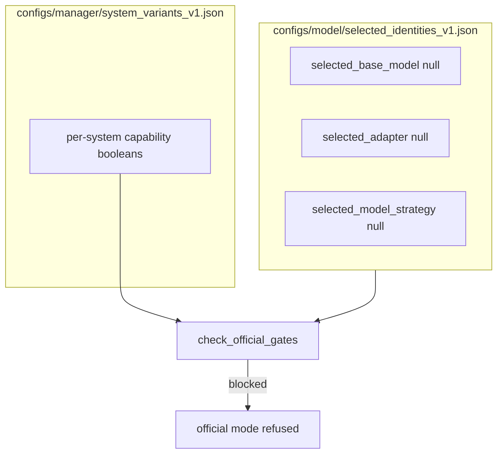
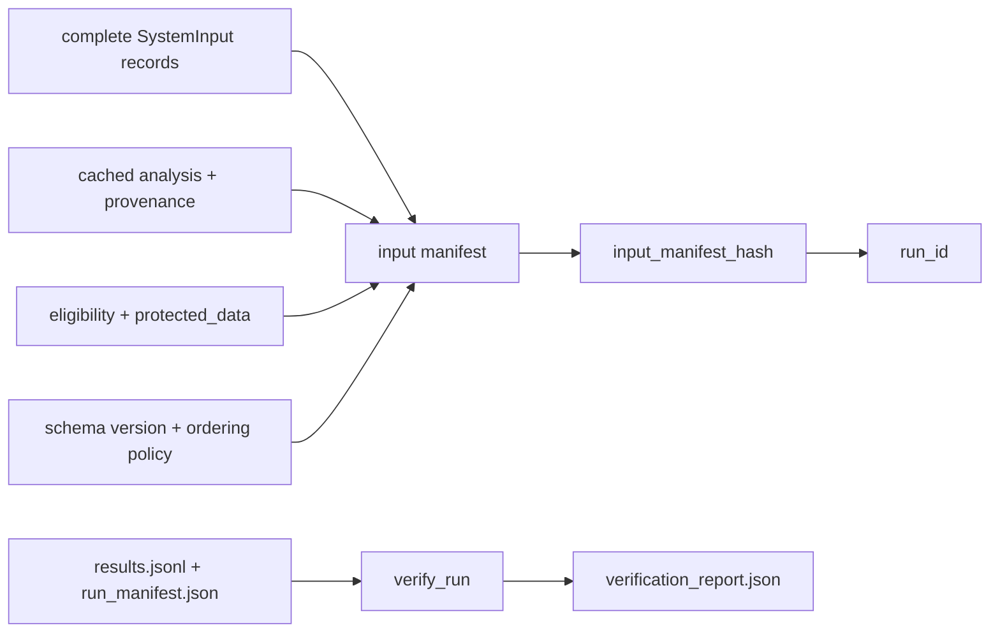

# Ticket report — T16–T24 model-independent foundation

**Author:** Mohammed Bangie — 2610990
**Decision:** `DEC-20260722-001`
**Branch:** `feature/t12-cluster-redesign`
**Scope:** shared contracts, deterministic components, seven-system adapters, evaluator, gated runner, synthetic fixtures
**Not in scope:** model selection/inference, QLoRA, supervisor annotation, adjudicated gold, official metrics, T25 LLM judge, T27–T31 execution

## Correctness hardening (follow-up pass)

A coordinated correctness-hardening pass closed 25 reproduced defects in system ablation validity, analysis immutability, routing/safety, evaluator mathematics, and runner identity/verification. See the dedicated report:

**`docs/reports/ticket_T16_T24_correctness_hardening.md`**

Foundation architecture and synthetic scope are unchanged in intent; metric conventions, conditional denominators, per-system evaluation, official gates, and run identity semantics were corrected and regression-tested.

## Model identity contract (null — unchanged)

Formal three-part identity in `configs/model/selected_identities_v1.json`:

| Field | Current value |
|---|---|
| `selected_base_model` | `null` |
| `selected_adapter` | `null` |
| `selected_model_strategy` | `null` |
| `status` | `no_selection` |
| `valid_for_official_use` | `false` |

Legacy `configs/licences/model_licence_register.json → selected_model` remains `null` and is deprecated in favour of the contract above. No model, adapter, or strategy was selected during foundation or hardening work.

All evaluator and manager policies likewise remain `valid_for_official_use: false` until T29 protocol freeze.

## Ticket-to-implementation mapping

| Ticket | Mapping | Status note |
|---|---|---|
| T16 | interface only now for model path; synthetic adapter + provider contract implemented | `direct_base_llm` → `provider_unavailable` without provider |
| T17 | implement now (deterministic candidate service + fixtures) | synthetic validation complete |
| T18 | implement now over supplied samples (no model sampling) | thresholds unfrozen / development_only |
| T19 | implement now (aggregation + deterministic router) | model classifier remains provider-gated |
| T20 | implement now (deterministic resolver) | official scoring blocked on gold |
| T21 | implement now (safety enforcement findings) | external live safety provider not required |
| T22 | implement now (template generators); provider wording interface-only | synthetic validation complete |
| T23 | implement now (seven adapters + registry + synthetic smoke) | not empirically complete |
| T24 | implement now (deterministic evaluator + eligibility on synthetic gold) | official execution blocked |

## Components completed

- Shared `SystemInput` / `StructuredAnalysis` / `SystemResult` contracts
- Provider protocols + deterministic doubles + honest `ProviderUnavailableError`
- Candidate interpretation validation/fingerprints (semantic material fingerprints)
- Context-sampling uncertainty diagnostics over supplied analyses
- Context resolver with evidence/rule IDs (slot-targeted resolution)
- Ambiguity/risk/capability aggregation
- Deterministic route precedence router with rule traces
- Safety enforcement (fail-closed critical findings)
- Clarification/rejection template generators (candidate-grounded)
- All seven comparison systems
- Per-system capability registry (`configs/manager/system_variants_v1.json`)
- Three-part model identity contract (`configs/model/selected_identities_v1.json`, all null)
- Experiment runner modes: `synthetic_smoke`, `development`, `official` (gated)
- `RunContext` runner-owned `synthetic_only` / `official_result` flags, with official `pending_official` → `approved_official` transition
- Full content input manifest (including analysis variant + source-input hash) and strengthened `verify_run()`
- Strict context-blind ablation: fresh or matching ablated analysis only (no full-context sanitisation fallback)
- Deterministic evaluator metrics + conditional denominator reporting
- Per-system evaluation bundles (no silent last-wins)
- Synthetic fixture suite (16 records) + hand-calculated expected metrics doc

## Components interface-only

- Model-backed structured analysis / direct LLM / future clarification-rejection LLM wording
- Bounded regeneration after safety rejection
- External live safety provider loop beyond deterministic findings

## Blocked on model strategy

- Real T16 direct-base predictions
- Provider-backed full-manager semantic analysis without deterministic fixtures
- Official model-backed system runs (gates require non-null identities where declared)

## Blocked on adjudicated gold / T15 / T29

- Official scoring and research performance claims
- Threshold freeze
- Train/dev/protected-test split freeze
- Official experiment evidence under non-synthetic paths

## Architecture (post-hardening)

### Manager flow



### Seven-system comparison + evaluation



### Capability registry and official gates



### Run identity: input manifest and verification



## Seven systems

1. `always_execute` — shared cached analysis; force execute; retain safety findings
2. `always_clarify` — force clarify; record unnecessary clarification when no target
3. `always_silently_resolve` — force silent; preserve unsupported resolution honestly
4. `direct_base_llm` — provider-driven; not executable without provider
5. `degree_based_router` — scalar uncertainty only; routes ∈ {execute, silently_resolve, clarify}
6. `context_blind_manager` — ablates dialogue/scene/capability without mutating input; accepts only fresh ablated analysis or matching `context_blind` cache (never sanitises full-context cache)
7. `full_type_risk_aware_manager` — full deterministic pipeline; awaits T28 adapter; not empirically complete

## Safety invariants

- Unsupported selected interpretation / silent resolve without evidence recorded
- Execute with unresolved critical slots recorded
- Capability overcommitment recorded
- Invalid clarify/reject/strategy sequences recorded
- No silent repair without findings
- Unknown risk/capability never treated as safe execute
- Multi-step routes do not precommit execute before clarification

## Evaluator metrics

Intent, CPC (P/R/F1, exact, critical, joint), candidate-set (semantic fingerprints), ambiguity (micro/macro/exact/compound), risk, capability, routing (accuracy, per-route F1, four-way decomposition, risk-sensitive), safety/interaction rates (conditional denominators), structural clarification/rejection checks. Interpretation correctness requires intent **and** CPC-frame match. Every metric reports total/eligible/excluded/reasons/numerator/denominator/value.

Hand-calculated reference: `docs/testing/t24_hand_calculated_metric_fixtures.md`

## Runner gates

Official mode refuses start without adjudicated gold, T15 split manifest, protocol-freeze ID, handbook version, and (per capability registry) approved model strategy/base model/provider/provenance for each selected system. Protected-label leakage and protected-data records outside official mode are explicit blocking gates. Gates derive from the capability registry, not hard-coded system-name checks.

## Confirmation

- Correctness-hardening pass completed (see linked report).
- No official experiment was executed.
- T13 calibration packages were not used as gold.
- No human annotations or adjudicated gold were created.
- No model inference/training occurred.
- Model identities remain null; `valid_for_official_use` remains false.
- No torch/transformers/vllm imports on the systems/evaluation foundation import path.

## Synthetic smoke

```text
python scripts/run_manager_experiment.py --run-synthetic configs/experiments/synthetic_smoke_v1.json
```

Outputs under `outputs/manager_experiments/synthetic/` are labelled `synthetic_only: true`, `official_result: false`.
