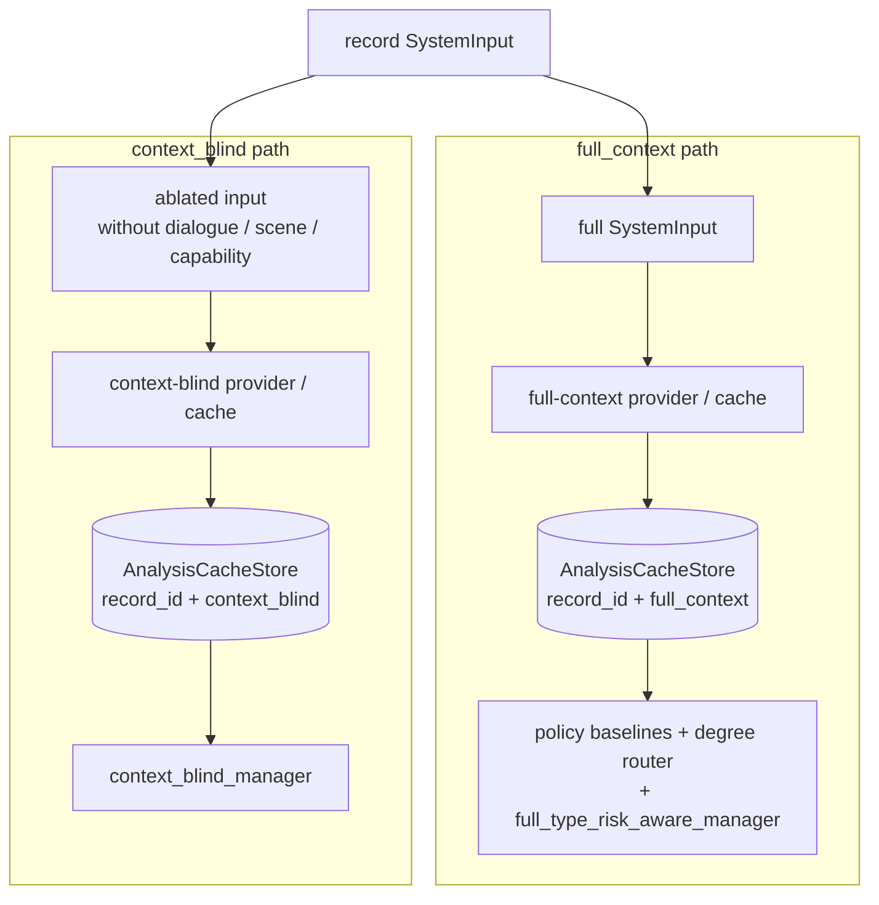

# Report — variant-aware analysis cache completion

**Author:** Mohammed Bangie — 2610990  
**Decision:** `DEC-20260722-002`  
**Branch:** `feature/t12-cluster-redesign`  
**Scope:** typed per-variant analysis cache, coverage matrix, system-to-variant registry, legacy compatibility policy  
**Precedes:** model-backed bake-off cache population, official per-system provenance enforcement  
**Does not select:** any base model, adapter, or model strategy

## Problem

The T16–T24 foundation initially assumed **one `StructuredAnalysis` per `record_id`**. All systems that consumed cached analysis shared that single entry. That design could not simultaneously hold:

- a **full-context** analysis for policy baselines and the full manager, and
- a **context-blind** analysis produced from an ablated input for `context_blind_manager`.

Shared flat caches also prevented **official provenance per record / system / variant**: a single entry could not record distinct provider identity, source-input hash, or analysis content hash for each required variant.

Cross-variant reuse would leak scene-derived semantics into the context-blind ablation (see `docs/reports/ticket_T16_T24_context_ablation_and_run_status_fix.md`).

## Solution

Introduced a variant-aware cache layer in `src/ambiguity_manager/systems/analysis_cache.py`:

| Component | Role |
|---|---|
| `AnalysisCacheKey` | Typed identity `(record_id, analysis_variant)` |
| `AnalysisCacheEntry` | Stored analysis plus provenance fields required for coverage gates |
| `AnalysisCacheStore` | Strict `(record_id, variant) → entry` map; no cross-variant fallback |
| `build_coverage_matrix` | Required coverage for every `(record, system, required variant)` tuple |

Each entry records at minimum: `source_input_hash`, `analysis_content_hash`, provider IDs/versions, selected model identity fields (nullable), prompt/schema metadata, and an optional `AnalysisIdentity`.

## Supported variants

Exactly two analysis variants are supported (from `ANALYSIS_VARIANTS`):

| Variant | Input basis | Typical consumers |
|---|---|---|
| `full_context` | Canonical `SystemInput` (command + dialogue + scene + capability) | Policy baselines, degree router, full manager |
| `context_blind` | Ablated input (`record.without_context()`) | `context_blind_manager` only |

## System-to-variant mapping

Declared in `REQUIRED_ANALYSIS_VARIANT` (`analysis_cache.py`) and mirrored in `configs/manager/system_variants_v1.json → required_analysis_variant`:

| System | Required variant |
|---|---|
| `always_execute` | `full_context` |
| `always_clarify` | `full_context` |
| `always_silently_resolve` | `full_context` |
| `degree_based_router` | `full_context` |
| `full_type_risk_aware_manager` | `full_context` |
| `context_blind_manager` | `context_blind` |
| `direct_base_llm` | `None` (live provider; no shared semantic cache) |

Five systems (`SHARED_FULL_CONTEXT_SYSTEMS`) must share one identical full-context analysis identity per record when supplied from cache.

## Legacy compatibility

| Mode | Flat `{record_id: StructuredAnalysis}` | Behaviour |
|---|---|---|
| Synthetic / development (`run_mode != "official"`) | Accepted | Coerced to `full_context` with `DeprecationWarning`; `source_input_hash` marked `legacy_unverified` |
| Official (`run_mode == "official"`) | Rejected | `SystemsContractError`; callers must supply typed keys or nested variant maps |

Explicit migration helper: `migrate_legacy_cache()` converts flat maps into typed `full_context` entries when full `SystemInput` records are available.

## Analysis variants flow



Lookup never falls back across variants. The coverage matrix validates that each system's required variant is present (or honestly marked producible by a provider in non-official modes).

## Files changed (key paths)

| Area | Path |
|---|---|
| Cache implementation | `src/ambiguity_manager/systems/analysis_cache.py` |
| Runner / cache wiring | `src/ambiguity_manager/systems/execution.py` |
| Experiment runner | `scripts/run_manager_experiment.py` |
| Bake-off cache emission | `src/ambiguity_manager/model/bakeoff_provider.py` |
| System capability registry | `configs/manager/system_variants_v1.json` |
| Cluster bake-off profile | `configs/cluster/t12_job_profiles.json` |
| Regression tests | `tests/test_variant_aware_analysis_cache.py` |
| Related hardening | `tests/test_t16_t24_run_status_hardening.py`, `tests/test_model_candidate_bakeoff_operator.py` |

## Tests and evidence

| Suite | Focus | Count |
|---|---|---|
| `tests/test_variant_aware_analysis_cache.py` | keys, store, coverage matrix, legacy modes, migration, system mapping | **33 tests** |

```bash
python -m unittest tests.test_variant_aware_analysis_cache -v
```

## Decision reference

`DEC-20260722-002` requires variant-aware caching so `full_context` and `context_blind` analyses can coexist per record without cross-variant leakage during development on source/synthetic data.

## Confirmation

- No base model, adapter, or strategy was selected.
- No official experiment was executed.
- T13 calibration records were not used as cache or gold sources.
- `valid_for_official_use` remains `false` for all related configs.
